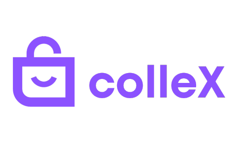
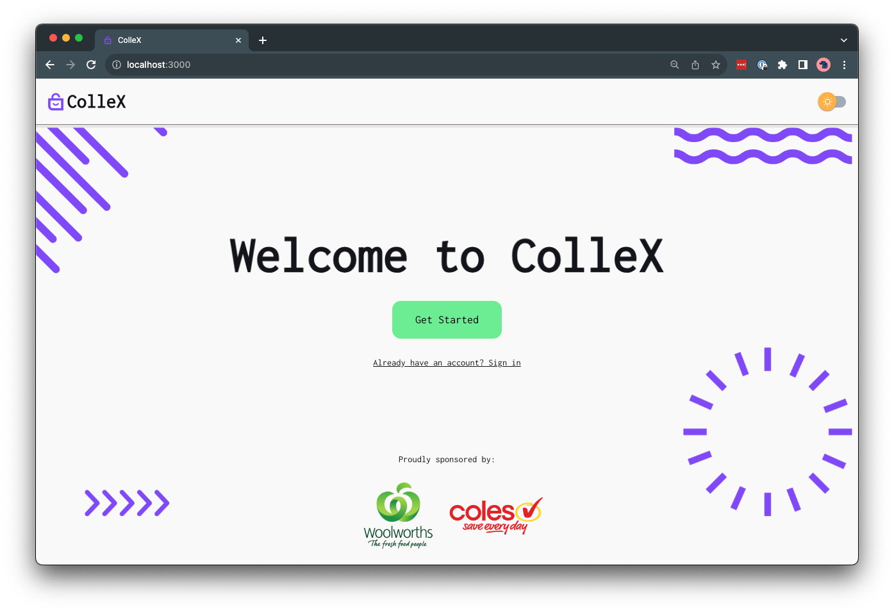

  

# 🚀 ColleX

## 🧐 Project Description

Woolworths/Coles Collectables Exchange Management System Project

Collectibles campaigns run by retail giants like Woolworths and Coles have gained immense popularity, attracting customers to collect and trade items to complete a set. A Collectables Exchange Management System is introduced to help with the exchange of collectibles among customers.

  

## 🏃 Running the Application

### ⚙️ Backend

To run the backend, run the following commands:

`cd backend`

`./build.sh`

`./run.sh`

You can access the API documentation at:

http://localhost:8080/apidocs

Note, remember to add executable permission to the script files: `chmod +x build.sh run.sh entrypoint.sh`

### 🖼️ Frontend

To run the frontend, run the following commands:

`cd frontend`

`npm install`

`npm run dev`

You can access the site at:

http://localhost:3000
